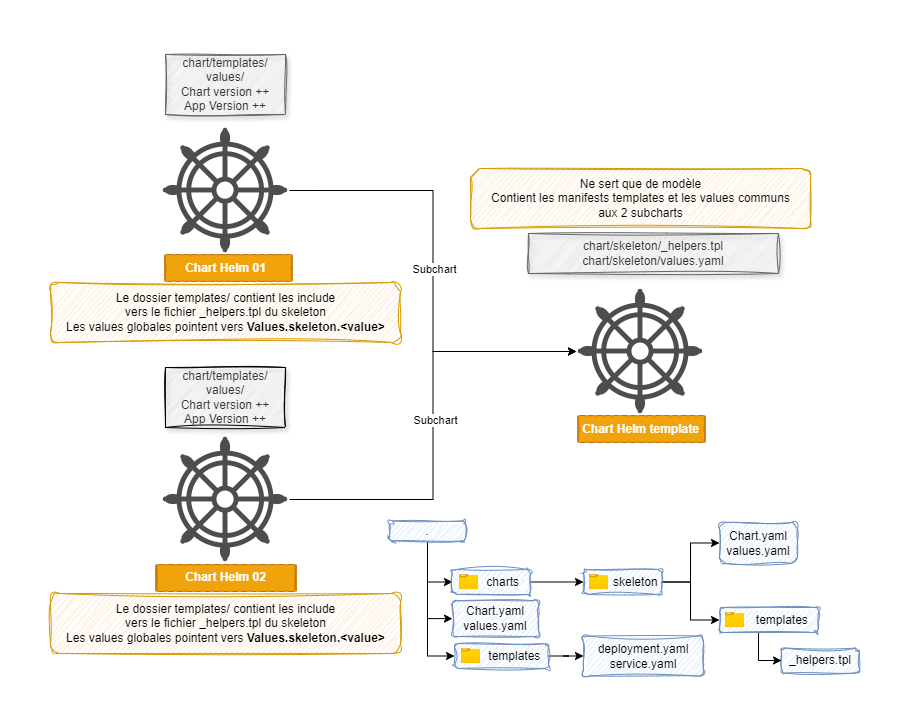

# Chart Helm Skeleton

L’idée ici est de créer un chart Helm qui va servir de squelette et de base à un ensemble de charts Helm.  
Ce chart Helm contiendra les modèles de différents manifestes qui seront utilisés par les charts Helm “dépendants”.

